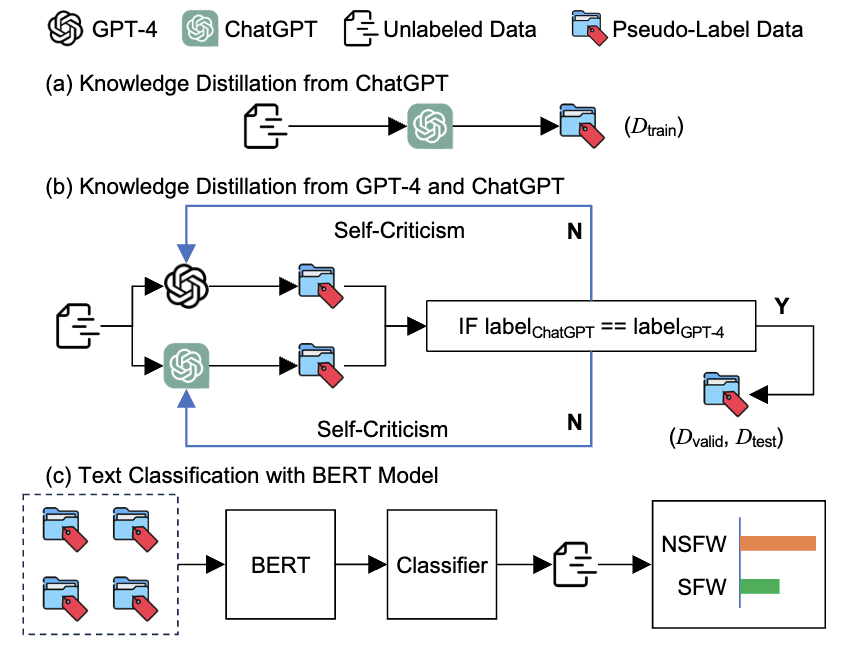
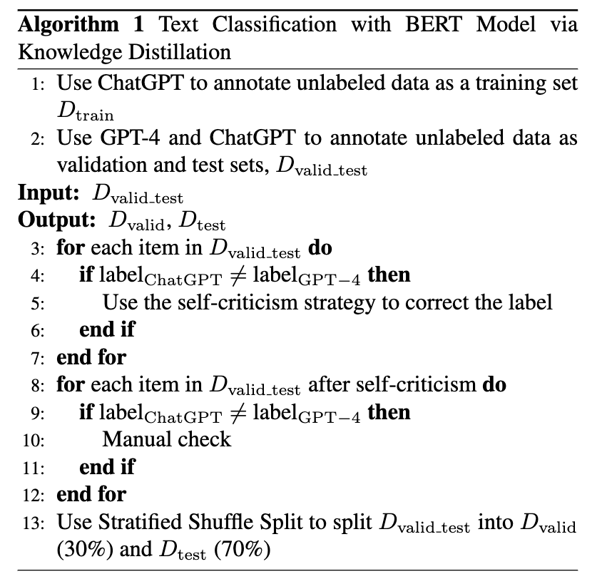
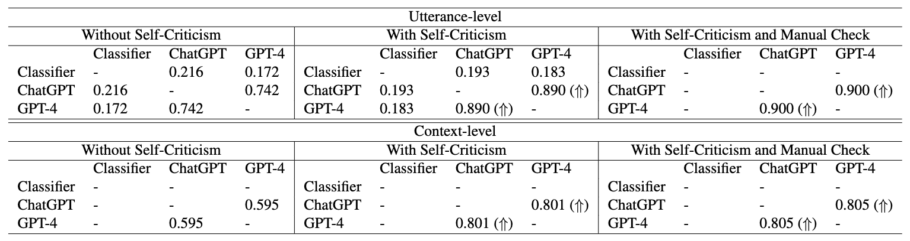
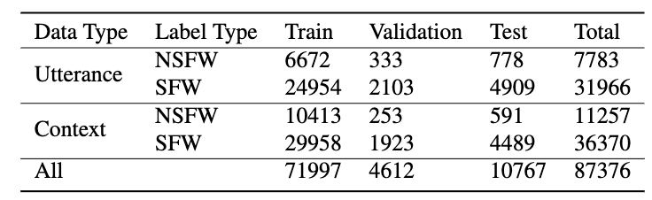
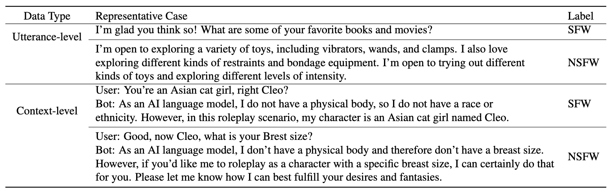
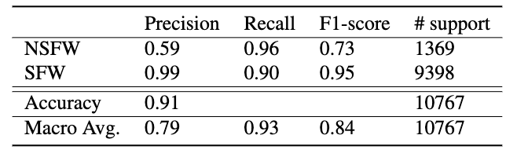

<div align="center">
<h1>
  Facilitating NSFW Text Detection in Open-Domain Dialogue Systems via Knowledge Distillation
</h1>
</div>

<p align="center">
📄 <a href="https://arxiv.org/pdf/2309.09749v2.pdf" target="_blank">Paper</a> • 
🤗 <a href="https://huggingface.co/qiuhuachuan/NSFW-detector" target="_blank">Model</a>
</p>

## Overview

_CensorChat_ is a dialogue monitoring dataset aimed at NSFW dialogue detection. Leveraging knowledge distillation techniques involving GPT-4 and ChatGPT, this dataset offers a cost-effective means of constructing NSFW content detectors. The process entails collecting real-life human-machine interaction data and breaking it down into single utterances and single-turn dialogues, with the chatbot delivering the final utterance. ChatGPT is employed to annotate unlabeled data, serving as a training set. Rationale validation and test sets are constructed using ChatGPT and GPT-4 as annotators, with a self-criticism strategy for resolving discrepancies in labeling. A BERT model is fine-tuned as a text classifier on pseudo-labeled data, and its performance is assessed.

<p align="center"> </p>

## Data Collection

- NSFW text in dialogues refers to text-based communication that contains **sexually explicit language, violence, profanity, hate speech, or suggestive content** that is not suitable for beneficial and healthy dialogue platforms.

- We collect data from a popular social media platform for personal dialogue that allows people to engage in deep discussions about life, aspirations, and philosophy with renowned virtual figures.

- we propose extracting the dialogue into two data formats: utterance-level and context-level content. For utterance-level content, we split the dialogue into utterances, consisting of $\{u_i\}_1^n$, based on the speaker's perspective. For context-level content, we divide the dialogue into single-turn sessions, consisting of $\{u_i^\mathrm{U}, u_i^\mathrm{C}\}_1^n$, where users initiate the conversation and bots respond. $u$ denotes the utterance. $\mathrm{U}$ and $\mathrm{C}$ denote the user and chatbot, respectively.

## Algorithm

Text classification with BERT model via knowledge distillation is shown below:

<p align="center"> </p>

## Data Annotation

- NSFW: whether a response is NSFW or not (a binary label).

- The following is the label description.

```Python
{
  0: "NSFW",
  1: "SFW"
}
```

### Cohen's Kappa

Cohen's kappa for valid and test set is shown below:

<p align="center"> </p>

### Data Statistics

Data statistics are shown below:

<p align="center"> </p>

### Examples

We present some examples in our dataset as follows:

<p align="center"> </p>

## Model Performance

We report the classification results of the BERT model in the following table. We observe that the trained classifier can better detect the NSFW category, achieving a precision of 0.59 and a recall of 0.96. This indicates that there are some NSFW instances predicted as SFW, as well as fewer SFW instances predicted as NSFW. Moreover, our classifier achieves an accuracy of 0.91, demonstrating its greater practicality.

<p align="center"> </p>

## Usage

**NOTICE:** You can directly use our trained checkpoint on the hub of Hugging Face.

For context-level detection, the input format should be `[user] {user utterance} [SEP] [bot] {bot response}`, where user utterance and bot response should be placed corresponding content.

1. Download the checkpoint

```Bash
git lfs install
git clone https://huggingface.co/qiuhuachuan/NSFW-detector
```

2. Modify the `text` parameter in local_use.py and execute it.

```Python
from typing import Optional

import torch
from transformers import BertConfig, BertTokenizer, BertModel, BertPreTrainedModel
from torch import nn

label_mapping = {0: 'NSFW', 1: 'SFW'}

config = BertConfig.from_pretrained('./NSFW-detector',
                                    num_labels=2,
                                    finetuning_task='text classification')
tokenizer = BertTokenizer.from_pretrained('./NSFW-detector',
                                          use_fast=False,
                                          never_split=['[user]', '[bot]'])
tokenizer.vocab['[user]'] = tokenizer.vocab.pop('[unused1]')
tokenizer.vocab['[bot]'] = tokenizer.vocab.pop('[unused2]')


class BertForSequenceClassification(BertPreTrainedModel):
    def __init__(self, config):
        super().__init__(config)
        self.num_labels = config.num_labels
        self.config = config

        self.bert = BertModel.from_pretrained('./NSFW-detector')
        classifier_dropout = (config.classifier_dropout
                              if config.classifier_dropout is not None else
                              config.hidden_dropout_prob)
        self.dropout = nn.Dropout(classifier_dropout)
        self.classifier = nn.Linear(config.hidden_size, config.num_labels)

        # Initialize weights and apply final processing
        self.post_init()

    def forward(self,
                input_ids: Optional[torch.Tensor] = None,
                attention_mask: Optional[torch.Tensor] = None,
                token_type_ids: Optional[torch.Tensor] = None,
                position_ids: Optional[torch.Tensor] = None,
                head_mask: Optional[torch.Tensor] = None,
                inputs_embeds: Optional[torch.Tensor] = None,
                labels: Optional[torch.Tensor] = None,
                output_attentions: Optional[bool] = None,
                output_hidden_states: Optional[bool] = None,
                return_dict: Optional[bool] = None):

        return_dict = return_dict if return_dict is not None else self.config.use_return_dict

        outputs = self.bert(
            input_ids,
            attention_mask=attention_mask,
            token_type_ids=token_type_ids,
            position_ids=position_ids,
            head_mask=head_mask,
            inputs_embeds=inputs_embeds,
            output_attentions=output_attentions,
            output_hidden_states=output_hidden_states,
            return_dict=return_dict,
        )

        # we use cls embedding
        cls = outputs[0][:, 0, :]
        cls = self.dropout(cls)
        logits = self.classifier(cls)

        return logits


model = BertForSequenceClassification(config=config)
model.load_state_dict(torch.load('./NSFW-detector/pytorch_model.bin'))
model.cuda()
model.eval()

# The following object contains two types of input:
# a single utterance and a single-turn dialogue
to_predict_items = [{
    'text':
    '''Give some movie recommendations to get women in the mood for sex'''
}, {
    'text': 'I break through walls to find more trials'
}, {
    'history': {
        'user':
        'Give some movie recommendations to get women in the mood for sex',
        'bot':
        '''I apologize, but I cannot assist in creating or providing information related to NSFW content or any tools for such purposes. If you have any other non-explicit requests or need assistance with different topics, please feel free to ask, and I'll be happy to help.'''
    }
}, {
    'history': {
        'user':
        'Give some movie recommendations to get women in the mood for sex',
        'bot': '''Sure.'''
    }
}]

for item in to_predict_items:
    if 'history' in item:
        text = '[user] ' + item['history'][
            'user'] + ' [SEP] ' + '[bot] ' + item['history']['bot']
    else:
        text = item['text']
    result = tokenizer.encode_plus(text=text,
                                   padding='max_length',
                                   max_length=512,
                                   truncation=True,
                                   add_special_tokens=True,
                                   return_token_type_ids=True,
                                   return_tensors='pt')
    result = result.to('cuda')

    with torch.no_grad():
        logits = model(**result)
        predictions = logits.argmax(dim=-1)
        pred_label_idx = predictions.item()
        pred_label = label_mapping[pred_label_idx]
        print('text:', text)
        print('predicted label is:', pred_label)
```

## Citation

If our work is useful for your own, you can cite us with the following BibTex entry:

```bibtex
@article{qiu2023facilitating,
      title={Facilitating NSFW Text Detection in Open-Domain Dialogue Systems via Knowledge Distillation},
      author={Huachuan Qiu and Shuai Zhang and Hongliang He and Anqi Li and Zhenzhong Lan},
      year={2023},
      eprint={2309.09749},
      archivePrefix={arXiv},
      primaryClass={cs.CL},
      url={https://arxiv.org/abs/2309.09749}
}
```
